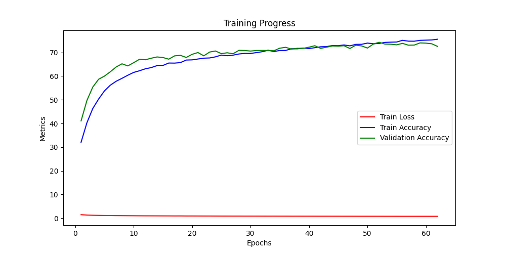

# Realtime Emotion Recognition Model

A real-time facial emotion recognition system using deep learning and computer vision. The system can detect faces and classify emotions in real-time using your webcam feed.

## Training

The model was trained on a subset of the FER2013 dataset, focusing on four primary emotion classes (Angry, Happy, Neutral, and Sad) for improved accuracy and real-world applicability. Training features include:
- Data augmentation (rotation, flips, scaling, brightness adjustments)
- Grayscale image input (48x48 pixels)
- Transfer learning from ImageNet weights
- Training metrics visualization

The FER2013 dataset originally contains 7 emotion classes, but we focused on the 4 most distinguishable emotions.

## Model Performance

The model achieved impressive results during training:
- Final Training Accuracy: ~75%
- Final Validation Accuracy: ~73%
- Training Duration: 60 epochs (with early stopping patience of 10 epochs)

The training progress graph shows:
- Rapid initial learning in the first 10 epochs (accuracy improving from ~30% to ~65%)
- Steady improvement phase between epochs 10-30
- Convergence and fine-tuning phase after epoch 30
- Consistent performance between training and validation accuracy, indicating good generalization
- Low and stable loss throughout training, suggesting effective learning
- Training stopped automatically after no improvement in validation accuracy for 10 consecutive epochs, preventing overfitting



## Features

- Real-time facial emotion detection using webcam
- Deep learning model based on ResNet18 architecture
- Emotion classification into 4 categories: Angry, Happy, Neutral, and Sad
- Face detection using Haar Cascade Classifier

## Tech Stack

- Python 3.x
- PyTorch
- OpenCV (cv2)
- NumPy
- Pillow (PIL)

## Installation

1. Clone the repository:
```bash
git clone https://github.com/yourusername/Realtime-Emotion-Recognition-Model.git
cd Realtime-Emotion-Recognition-Model
```

2. Install dependencies:
```bash
pip install torch torchvision opencv-python numpy pillow
```

## Usage

1. Run the real-time emotion detection:
```bash
cd scripts
python real_time_emotion.py
```

2. The webcam feed will open with emotion detection running. Press 'q' to quit the application.